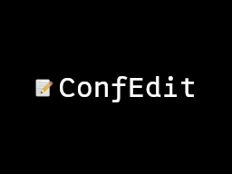

# ConfigEdit

Small homebrew to edit config files on the Nintendo DS.

<p align="center">
  
</p>

## Features
- Browse directories and files
- View, edit and save config files
- Touchscreen keyboard support  
Supports : `.ini`, `.txt`, `.xml`, `.cfg`, `.json`

## Install

No release yet, still WIP 

## Building

1. Set up devkitPro by following official guide:  
[https://devkitpro.org/wiki/Getting_Started](https://devkitpro.org/wiki/Getting_Started)
2. Build ConfigEdit : 
```bash
# Clone this repository:
git clone https://github.com/bunigost/ConfigEdit.git
# Navigate to the project folder:
cd ConfigEdit
# Build:
make
```
5. Copy `ConfigEdit.nds` to your Nintendo DS.

## Usage

File Browser :
- D-Pad Up/Down : move cursor by one line
- D-Pad Left/Right : scroll faster 
- A : Open directory or file
- B : Close directory
- Start : Close ConfigEdit

Text Editor :
- D-Pad : move the cursor
- Use the touch keyboard to insert or delete characters
- Start : save the file
- B : close file without saving